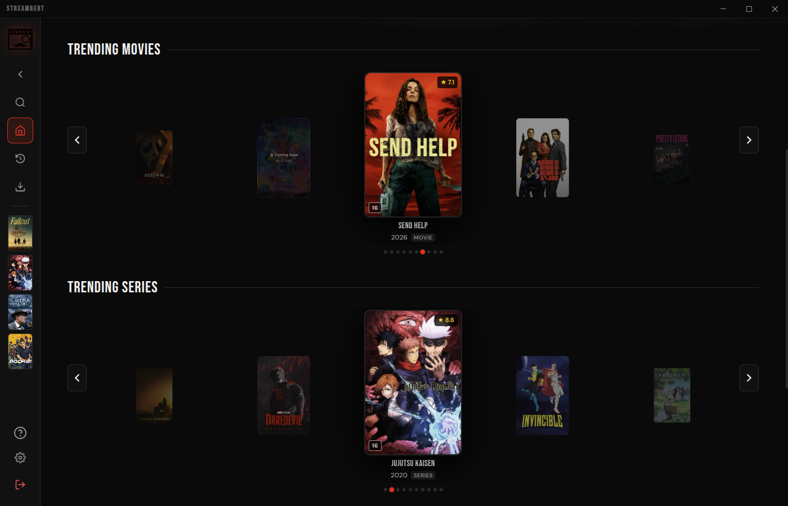
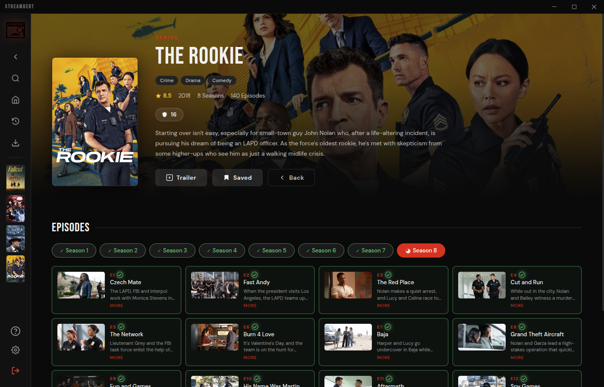
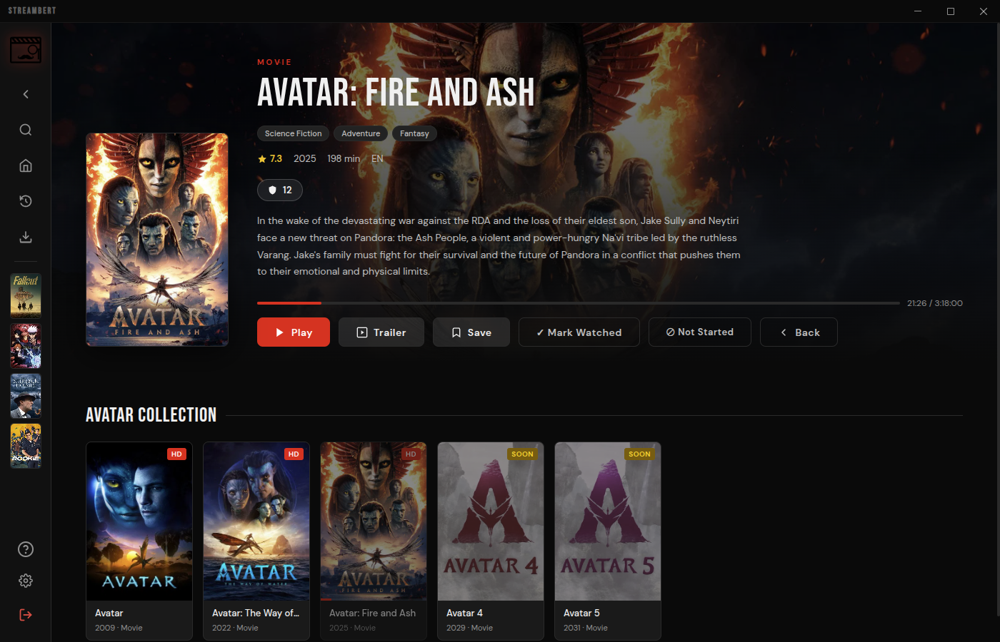
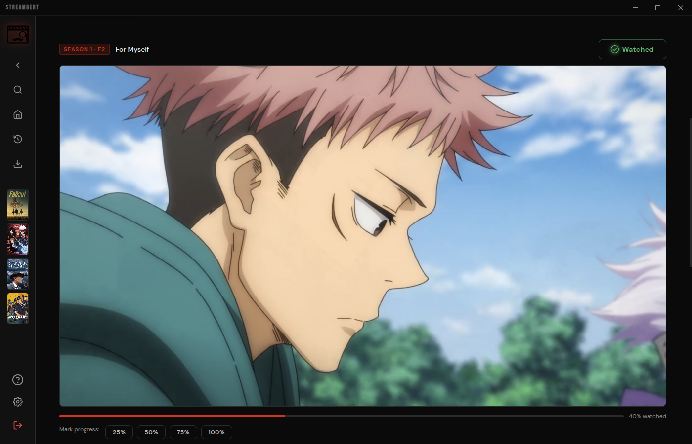
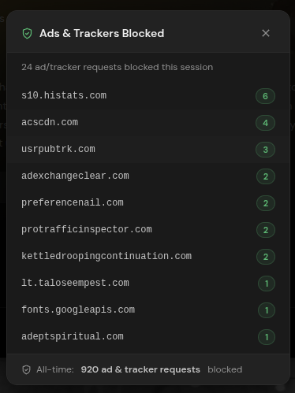
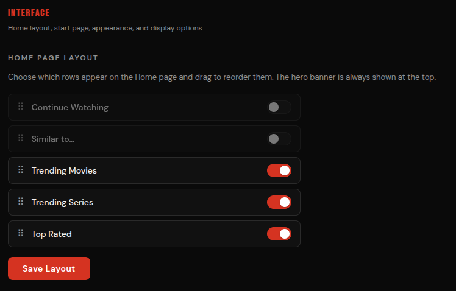
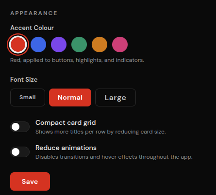
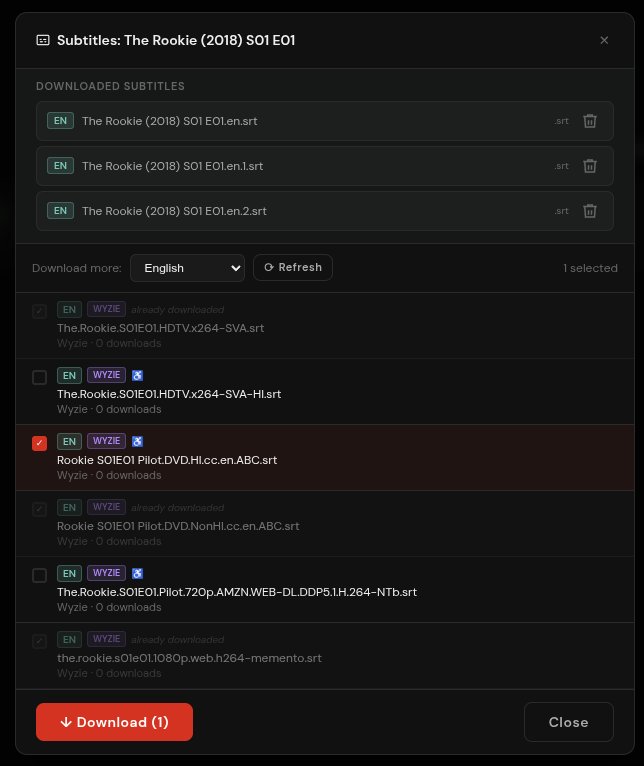
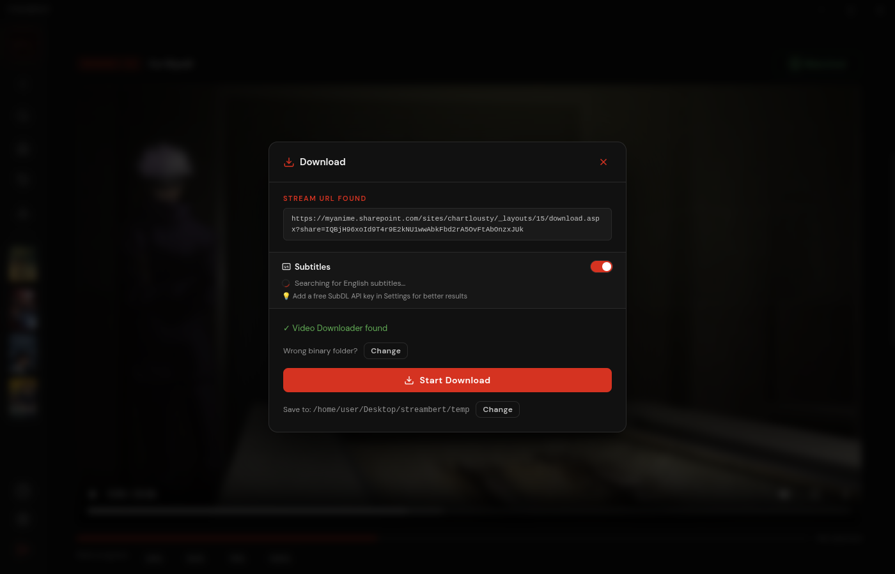

[](https://github.com/truelockmc/streambert)
[](https://github.com/Azimlearning/MovieVault)

# MovieVault
MovieVault is a cross-platform Electron Desktop App to stream and download any Movie, TV Series or Anime in the world, with zero ads or trackers.

> [!NOTE]
> **This is a personal project modified for personal use.** It is a customized fork of the original [Streambert](https://github.com/truelockmc/streambert) repository by `truelockmc`.

### Added Features & Modifications in this Fork:
* 🎬 **Netflix-Style Auto-Play next episode:** Displays a 15-second countdown banner 30s before the end of TV episodes to auto-advance to the next episode (fully overlays in custom fullscreen mode).
* ⚙️ **Videasy priority source:** Defaults to loading the highly stable Videasy player first, automatically failing over to VidSrc/2Embed only if issues occur, and resetting the failover queue on Retry.
* ⚡ **Autoplay execution:** Bypasses browser gesture restrictions via Chromium flags and custom IPC subframe script injection to start video streams automatically on loading a title.
* 📊 **Library Dashboard & Stats:** Adds tabs (*Watching, Watchlist, Finished, Stats*), streak counters, hours watched metrics, and top genre popularity indicators.
* 🔗 **Trakt, AniList & Discord integration:** Syncs playback stats to Trakt/AniList via a local OAuth loopback server, and reflects watch state on Discord Rich Presence.
* 🔍 **Fuzzy library search:** Employs character subsequence matching for robust local database search.

[Installation](#installation) | [Requirements](#requirements)

## Why MovieVault?
- 🎦 **Streaming:** Stream any Movie, Anime or TV Series from around the World.
- 📥 **Downloading:** Download anything you want to watch.
- 📃 **Subtitles:** Download and manage Subtitles.
- ⚙️ **Customizability:** Customize the Interface and Features to your unique needs.
- 📚 **Library:** Track what you watched, save stuff you want to watch and manage your Downloads.
- ✨ **Trending:** Discover new things to Watch every Day.
- 🛡️ **Privacy:** Completely Ads and Tracker free, forever.
- ⚡ **Speed:** Stream faster than any Browser can, download with multithreading.










---
[](https://github.com/truelockmc/streambert/stargazers)
---
## Streaming
The Application mainly gets Video Streams from VidSrc (you can also Stream from videasy.net and 2Embed). <br></br>
It fetches Information for Images, Info Texts, Search and Homepage from [tmdb](https://www.themoviedb.org/).

---

## Downloading
You can download those Video Streams because the Program sources Links to their .m3u8 Playlist Files ([similar to this Browser Extension](https://addons.mozilla.org/en-US/firefox/addon/m3u8-link-finder/)). <br></br>
Once you click 'Download' these Links are used to download the Full Movie/TV Episode using [this Program](https://github.com/truelockmc/vid-dl-cli-only). You can then watch them In-App or take the Files on any Storage Medium you want.

---

## Anime
You can also watch Anime, the App checks if a Movie or Series is an Anime and then sources its Metadata from [AniList](https://anilist.co/) instead of [tmdb](https://www.themoviedb.org/). <br></br>
Media Files for Animes are scraped from AllManga.to (i stole this mechanic from [ani-cli](https://github.com/pystardust/ani-cli)). The App directly gets .mp4 Files and doesnt evem show you the AllManga website, you can also download these Files, just like any other Content.


## Requirements

- [Node.js](https://nodejs.org/) (>=22.12.0) installed (for building and running from source)
- A free TMDB API Read Access Token ([Guide on how to get one](tmdb-tutorial.md))
- For downloading:
  1. Download the [vid-dl-cli-only](https://github.com/truelockmc/vid-dl-cli-only/releases/latest) binary.
  2. Put it somewhere on your PC and configure its path in MovieVault (under Settings -> Downloads).
  3. Ensure [ffmpeg](https://ffmpeg.org/download.html) is installed and available in your system PATH.

---
## Setup & Installation

On first launch, MovieVault will prompt you to enter your TMDB API token. This is saved securely in local storage, so you only need to do this once.

### Running from Source (Recommended)
Since this is a personal fork, running directly from source is the easiest way to use the app and get the latest updates:

1. **Clone the repository:**
   ```bash
   git clone https://github.com/Azimlearning/MovieVault.git
   cd MovieVault
   ```
2. **Install dependencies:**
   ```bash
   npm install
   ```
3. **Build the web components and start the app:**
   ```bash
   npm start
   ```

### Building Distribution Binaries
If you want to package MovieVault into a standalone executable:

* **Windows Portable/Installer:**
  ```bash
  npm run dist:win
  ```
* **Linux (.deb, .AppImage, .pacman):**
  ```bash
  npm run dist:linux
  ```
* **Arch Linux (.pacman only):**
  ```bash
  npm run dist:arch
  ```
* **AppImage only:**
  ```bash
  npm run dist:appimage
  ```

> [!IMPORTANT]
> If you are building/installing on Arch Linux and encounter errors, you may need these libraries:
> - **libcrypt.so.1 error:** `sudo pacman -S libxcrypt-compat`
> - **http-parser dependency error:** `yay -S http-parser` (from AUR)

## Legal Disclaimer

**IMPORTANT: This application is for educational and personal use only.**

- MovieVault does not host, store, or distribute any copyrighted content
- All content is sourced from third-party providers and websites
- Users are solely responsible for ensuring they have legal rights to access any content
- The developer does not endorse or encourage copyright infringement
- Users must comply with all applicable laws in their jurisdiction
- Any legal issues should be directed to the actual content providers
- This app functions as a search engine aggregator only
- No copyrighted material is stored on our side

## Legal Notice

This application is provided "as is" for educational purposes. The developer:
- Does not claim ownership of any content
- Does not profit from copyrighted material in any way
- Does not control third-party content providers
- Encourages users to support content creators through legal means

[](https://repostars.dev/?repos=truelockmc%2Fstreambert&theme=dark)

<details>
    <summary>Project Structure</summary>
    
```
Project Root
├── index.html
├── main.js
├── package.json
├── preload.js
├── vite.config.js
├── LICENSE
├── README.md
├── public
│   ├── icon.png
│   ├── installer-sidebar.bmp
│   └── logo.svg
├── screenshots
│   ├── adblock.png
│   ├── anime.png
│   ├── api-settings_tmdb.png
│   ├── application_tmdb.png
│   ├── download.png
│   ├── icon.png
│   ├── movie.png
│   ├── personal-use_tmdb.png
│   ├── series.png
│   ├── setup.png
│   ├── signup_tmdb.png
│   ├── subs.png
│   ├── token_tmdb.png
│   └── trending.png
└── src
    ├── App.jsx
    ├── main.jsx
    ├── components
    │   ├── BlockedStatsModal.jsx
    │   ├── CloseConfirmModal.jsx
    │   ├── DownloadModal.jsx
    │   ├── ErrorBoundary.jsx
    │   ├── Icons.jsx
    │   ├── KeyboardShortcutsModal.jsx
    │   ├── MediaCard.jsx
    │   ├── SearchModal.jsx
    │   ├── SetupScreen.jsx
    │   ├── Sidebar.jsx
    │   ├── SubtitleDownloaderModal.jsx
    │   ├── TrailerModal.jsx
    │   ├── TrendingCarousel.jsx
    │   ├── UpdateModal.jsx
    │   └── WindowTitlebar.jsx
    ├── ipc
    │   ├── allmanga.js
    │   ├── blockStats.js
    │   ├── downloads.js
    │   ├── player.js
    │   ├── storage.js
    │   └── subtitles.js
    ├── pages
    │   ├── DownloadsPage.jsx
    │   ├── HomePage.jsx
    │   ├── LibraryPage.jsx
    │   ├── MoviePage.jsx
    │   ├── SettingsPage.jsx
    │   └── TVPage.jsx
    ├── styles
    │   ├── global.css
    │   └── fonts
    │       ├── bebas-neue-regular.woff2
    │       ├── dm-sans-300.woff2
    │       ├── dm-sans-500.woff2
    │       ├── dm-sans-600.woff2
    │       └── dm-sans-regular.woff2
    └── utils
        ├── ageRating.js
        ├── aniSkip.js
        ├── api.js
        ├── appearance.js
        ├── backup.js
        ├── episodeMappings.js
        ├── homeLayout.js
        ├── storage.js
        ├── subtitles.js
        ├── updates.js
        ├── useBlockedStats.js
        └── useRatings.js
```
</details>
